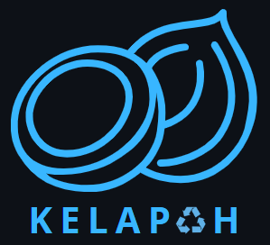

<p align="center"><a href="https://github.com/Rdx11/Kelapah/tree/master" target="_blank"></a></p>

## About Kelapah

Kelapah is an abbreviation for Kelola Sampah. This application is created with the aim of reducing the population of litter in inappropriate places. So, users can utilize the application to report litter, enabling further action to be taken.

## Requirements

- PHP 8.1 or higher
- Database (e.g., MySQL, PostgreSQL, SQLite, SQL Server)
- Web Server (e.g., Apache, Nginx, IIS)

## Installation

* Install [Composer](https://getcomposer.org/download) and [Npm](https://nodejs.org/en/download)
* Clone the repository: `git clone https://github.com/Rdx11/Kelapah.git`
* Install dependencies: `composer install ; npm install ; npm run dev`
* edit your `.env` file
* generate key:

    ```bash
    php artisan key:generate
    ```
* migrate database with seeder:

    ```bash
    php artisan migrate --seed
    ```
* create super admin data for control this app:

    ```bash
    php artisan make:kelapah-admin --force
    ```

## Support By

* [PT Amman Mineral Nusa Tenggara](https://www.amman.co.id/id/) - scholarship provider
* [Pintar](https://pintar.co/) - Media Learning
